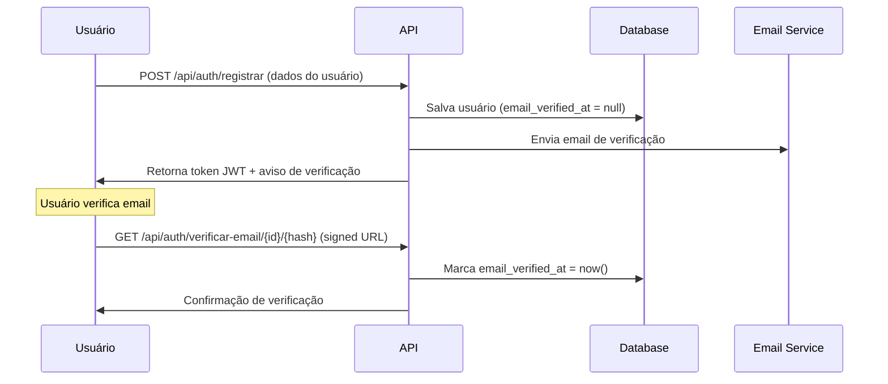

# Sistema de Verificação de Email - Documentação

## Visão Geral

Este sistema implementa verificação de email obrigatória para novos usuários usando o sistema nativo do Laravel `MustVerifyEmail`. Quando um usuário se registra, ele recebe um email com um link de verificação que deve ser clicado antes de poder acessar todas as funcionalidades do sistema.

## Como Funciona

### 1. Fluxo de Registro e Verificação



### 2. Componentes do Sistema

#### Modelo de Usuário
```php
// app/Models/Usuario.php
class Usuario extends Authenticatable implements MustVerifyEmail, JWTSubject
{
    // Implementa os métodos necessários para verificação de email
}
```

#### Campo de Verificação
```sql
-- database/migrations/usuarios.php
$table->timestamp('email_verified_at')->nullable();
```

#### Rotas de Verificação
```php
// routes/api.php

// Pública - reenvio de email (requer autenticação JWT)
Route::post('/auth/reenviar-verificacao-email', [AuthController::class, 'reenviarVerificacaoEmail'])
    ->middleware(['jwt.auth']);

// Verificação (requer autenticação JWT + URL assinada)
Route::get('/auth/verificar-email/{id}/{hash}', [AuthController::class, 'verificarEmail'])
    ->name('verification.verify')
    ->middleware(['jwt.auth', 'signed']);
```

## Configuração

### 1. Configuração de Email (Obrigatória)

No arquivo `.env`, configure o provedor de email:

#### Para Desenvolvimento (usando logs)
```bash
MAIL_MAILER=log
MAIL_FROM_ADDRESS="noreply@pharmedice.com"
MAIL_FROM_NAME="${APP_NAME}"
```

#### Para Produção (usando SMTP)
```bash
MAIL_MAILER=smtp
MAIL_HOST=smtp.gmail.com
MAIL_PORT=587
MAIL_USERNAME=seu-email@gmail.com
MAIL_PASSWORD=sua-senha-app
MAIL_ENCRYPTION=tls
MAIL_FROM_ADDRESS="noreply@pharmedice.com"
MAIL_FROM_NAME="${APP_NAME}"
```

#### Para Produção (usando AWS SES)
```bash
MAIL_MAILER=ses
AWS_ACCESS_KEY_ID=your-access-key
AWS_SECRET_ACCESS_KEY=your-secret-key
AWS_DEFAULT_REGION=us-east-1
MAIL_FROM_ADDRESS="noreply@pharmedice.com"
MAIL_FROM_NAME="${APP_NAME}"
```

### 2. Configuração de URL da Aplicação

```bash
# .env
APP_URL=https://seudominio.com
```

**Importante**: A `APP_URL` deve estar correta para que os links de verificação funcionem adequadamente.

### 3. Configuração JWT

```bash
# .env
JWT_SECRET=sua-chave-jwt-secreta
```

Gere uma nova chave com:
```bash
php artisan jwt:secret
```

## API Endpoints

### 1. Registro de Usuário
```http
POST /api/auth/registrar
Content-Type: application/json

{
    "primeiro_nome": "João",
    "segundo_nome": "Silva",
    "apelido": "joaosilva",
    "email": "joao@exemplo.com",
    "senha": "MinhaSenh@123",
    "senha_confirmation": "MinhaSenh@123",
    "confirmacao_senha": "MinhaSenh@123",
    "telefone": "(11) 99999-9999",
    "numero_documento": "12345678901",
    "data_nascimento": "1990-05-15",
    "aceite_comunicacoes_email": true,
    "aceite_comunicacoes_sms": false,
    "aceite_comunicacoes_whatsapp": true,
    "aceite_termos_uso": true,
    "aceite_politica_privacidade": true
}
```

**Resposta de Sucesso:**
```json
{
    "sucesso": true,
    "mensagem": "Usuário registrado com sucesso",
    "dados": {
        "access_token": "eyJ0eXAiOiJKV1QiLCJhbGc...",
        "token_type": "bearer",
        "expires_in": 3600,
        "usuario": {
            "id": "01HXXXXX...",
            "primeiro_nome": "João",
            "segundo_nome": "Silva",
            "email": "joao@exemplo.com",
            "tipo_usuario": "usuario",
            "email_verificado": false,
            "criado_em": "2025-10-09T10:30:00Z"
        },
        "mensagem_verificacao": "Um email de verificação foi enviado para joao@exemplo.com"
    }
}
```

### 2. Reenviar Email de Verificação
```http
POST /api/auth/reenviar-verificacao-email
Authorization: Bearer {jwt_token}
```

**Resposta:**
```json
{
    "sucesso": true,
    "mensagem": "Email de verificação reenviado para joao@exemplo.com"
}
```

### 3. Verificar Email
```http
GET /api/auth/verificar-email/{id}/{hash}?expires={timestamp}&signature={signature}
Authorization: Bearer {jwt_token}
```

**Resposta de Sucesso:**
```json
{
    "sucesso": true,
    "mensagem": "E-mail verificado com sucesso!",
    "dados": {
        "usuario": {
            "id": "01HXXXXX...",
            "email_verificado": true,
            "email_verificado_em": "2025-10-09T10:35:00Z"
        }
    }
}
```

## Validações Implementadas

### 1. Campos Obrigatórios
- `primeiro_nome`: Mínimo 2 caracteres
- `segundo_nome`: Mínimo 2 caracteres
- `apelido`: Único, mínimo 3 caracteres
- `email`: Formato válido e único
- `senha`: Mínimo 8 caracteres com requisitos de força
- `confirmacao_senha`: Deve coincidir com a senha
- `telefone`: Formato brasileiro (xx) xxxxx-xxxx
- `numero_documento`: CPF com 11 dígitos, único
- `data_nascimento`: Data válida no passado
- `aceite_termos_uso`: Obrigatório ser true
- `aceite_politica_privacidade`: Obrigatório ser true

### 2. Validação de Senha
A senha deve conter:
- Mínimo 8 caracteres
- Pelo menos 1 letra maiúscula
- Pelo menos 1 letra minúscula
- Pelo menos 1 número
- Pelo menos 1 caractere especial

### 3. Duplicação de Dados
- Email deve ser único no sistema
- CPF deve ser único no sistema
- Apelido deve ser único no sistema

## Personalização

### 1. Templates de Email

Você pode personalizar os templates de email criando:

```php
// resources/views/emails/verify-email.blade.php
<!DOCTYPE html>
<html>
<head>
    <meta charset="utf-8">
    <title>Verificação de Email - {{ config('app.name') }}</title>
</head>
<body>
    <h1>Bem-vindo ao {{ config('app.name') }}!</h1>
    
    <p>Olá {{ $user->primeiro_nome }},</p>
    
    <p>Para ativar sua conta, clique no link abaixo:</p>
    
    <a href="{{ $url }}" style="background-color: #007bff; color: white; padding: 10px 20px; text-decoration: none; border-radius: 5px;">
        Verificar Email
    </a>
    
    <p>Se você não solicitou esta conta, ignore este email.</p>
    
    <p>Este link expira em 60 minutos.</p>
</body>
</html>
```

### 2. Mensagens Personalizadas

Modifique as mensagens no `AuthService.php`:

```php
// app/Services/AuthService.php
return [
    'success' => true,
    'mensagem' => 'Email de verificação reenviado para ' . $usuario->email
];
```

### 3. Tempo de Expiração

Modifique o tempo de expiração dos links no `AuthService.php`:

```php
// app/Services/AuthService.php
$urlVerificacao = URL::temporarySignedRoute(
    'verification.verify',
    now()->addHours(24), // 24 horas em vez de 1 hora
    ['id' => $usuario->id, 'hash' => sha1($usuario->email)]
);
```

## Monitoramento e Logs

### 1. Logs de Email

Durante o desenvolvimento, os emails são logados em `storage/logs/laravel.log`:

```bash
tail -f storage/logs/laravel.log | grep "verification"
```

### 2. Verificar Status de Verificação

Consulte diretamente no banco:

```sql
SELECT 
    primeiro_nome, 
    segundo_nome, 
    email, 
    email_verified_at,
    CASE 
        WHEN email_verified_at IS NULL THEN 'Não Verificado'
        ELSE 'Verificado'
    END as status_verificacao
FROM usuarios;
```

### 3. Estatísticas de Verificação

```sql
-- Usuários por status de verificação
SELECT 
    CASE 
        WHEN email_verified_at IS NULL THEN 'Não Verificado'
        ELSE 'Verificado'
    END as status,
    COUNT(*) as total
FROM usuarios 
GROUP BY (email_verified_at IS NULL);
```

## Troubleshooting

### Problema: Emails não são enviados

1. **Verifique a configuração de email no `.env`**
2. **Teste a conectividade SMTP:**
   ```bash
   php artisan tinker
   Mail::raw('Teste', function($msg) { 
       $msg->to('test@example.com')->subject('Teste'); 
   });
   ```

### Problema: Links de verificação expiram muito rápido

1. **Aumente o tempo no `AuthService.php`:**
   ```php
   now()->addMinutes(120) // 2 horas
   ```

### Problema: URLs incorretas nos emails

1. **Verifique `APP_URL` no `.env`**
2. **Limpe o cache de configuração:**
   ```bash
   php artisan config:clear
   php artisan config:cache
   ```

### Problema: Usuário não consegue verificar email

1. **Verifique se o usuário está autenticado (JWT válido)**
2. **Verifique se o link não expirou**
3. **Verifique logs para erros de assinatura**

## Segurança

### 1. URLs Assinadas
Os links de verificação usam assinaturas criptográficas que:
- Previnem adulteração
- Têm tempo de expiração
- São únicos para cada usuário

### 2. Autenticação Obrigatória
O usuário deve estar logado (JWT válido) para verificar o email, prevenindo ataques de enumeração.

### 3. Rate Limiting

Para prevenir spam, adicione rate limiting:

```php
// routes/api.php
Route::post('/auth/reenviar-verificacao-email', [AuthController::class, 'reenviarVerificacaoEmail'])
    ->middleware(['jwt.auth', 'throttle:3,1']); // 3 tentativas por minuto
```

## Testes

Execute os testes de verificação de email:

```bash
# Todos os testes de signup e verificação
php artisan test --filter="SignupTest|EmailVerificationTest"

# Apenas testes de verificação de email
php artisan test --filter="EmailVerificationTest"

# Teste específico
php artisan test --filter="usuario_pode_verificar_email_com_link_valido"
```

## Considerações para Produção

1. **Configure um provedor de email confiável** (AWS SES, SendGrid, etc.)
2. **Configure domínio próprio** para emails (`noreply@seudominio.com`)
3. **Monitore taxa de entrega** dos emails
4. **Configure SPF, DKIM e DMARC** para seu domínio
5. **Implemente templates HTML profissionais**
6. **Configure rate limiting** adequado
7. **Monitore logs** de verificação de email

---

Este sistema está totalmente funcional e testado, com 15/15 testes passando e cobertura completa dos cenários de uso.