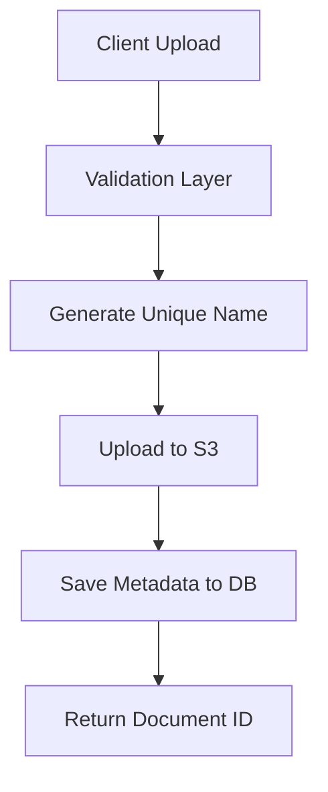

# System Concepts - Pharmedice Customer Area

> Core architectural concepts and design patterns used in the Pharmedice Customer Area backend system.

## 🏗️ System Architecture

### Overall Design Philosophy

The Pharmedice Customer Area backend follows a **layered architecture** with clear separation of concerns:

- **API Layer** - RESTful endpoints with standardized responses
- **Service Layer** - Business logic and data processing
- **Model Layer** - Data entities and relationships  
- **Infrastructure Layer** - External integrations (S3, Email, Database)

### Key Design Patterns

#### 1. Service Pattern
Business logic is encapsulated in dedicated service classes:
- `AuthService` - Authentication and user management
- `UsuarioService` - User CRUD operations
- `LaudoService` - Document management and file operations

#### 2. DTO Pattern (Data Transfer Objects)
Standardized data structures for API communication:
- Input validation and transformation
- Consistent response formats
- Type safety and documentation

#### 3. Repository Pattern (via Eloquent)
Data access abstraction through Laravel's Eloquent ORM:
- Clean separation between business logic and data persistence
- Testable data layer
- Consistent query patterns

## 🔐 Authentication & Authorization

### JWT (JSON Web Tokens)
- **Stateless authentication** - No server-side session storage
- **Token-based** - Portable across different clients/devices
- **Configurable expiration** - Default 60 minutes with refresh capability
- **Secure transmission** - Tokens contain encoded user information

### Multi-Role System
- **Administrator Role** (`administrador`)
  - Full CRUD access to all users and documents
  - System configuration capabilities
  - User management permissions
  
- **Client Role** (`usuario`)  
  - View own documents
  - Change own password
  - Search and filter accessible documents

### Middleware Chain
```php
// Example middleware stack for protected admin endpoint
Route::get('/usuarios', [UsuarioController::class, 'listar'])
    ->middleware(['jwt.auth', 'admin']);
```

## 📄 Document Management System

### File Storage Architecture
- **Local Processing** - Initial file validation and processing
- **Cloud Storage** - AWS S3 for persistent, scalable storage
- **Metadata Storage** - PostgreSQL for searchable document information
- **Access Control** - Role-based document visibility

### File Upload Flow


### Naming Convention
Files are stored with unique names to prevent conflicts:
```
{uuid}_{timestamp}_{original_name}.pdf
```

Organized by date hierarchy:
```
laudos/
├── 2024/
│   ├── 10/
│   │   ├── document1.pdf
│   │   └── document2.pdf
│   └── 11/
└── 2025/
```

## 🗄️ Database Design

### Primary Key Strategy
- **ULIDs (Universally Unique Lexicographically Sortable Identifiers)**
  - URL-safe, 26-character strings
  - Timestamp-ordered for better database performance
  - Globally unique across all tables

### Relationship Structure
```
Usuario (Users)
├── id (ULID, PK)
├── primeiro_nome, segundo_nome
├── email (unique)
├── numero_documento (unique CPF)
└── email_verified_at (timestamp)

Laudo (Documents)  
├── id (ULID, PK)
├── usuario_id (FK to Usuario)
├── titulo, descricao
├── url_arquivo (S3 path)
└── timestamps

Permissao (Permissions)
├── id (ULID, PK)
├── nome, descricao
└── timestamps

PermissaoDoUsuario (User Permissions)
├── usuario_id (FK to Usuario)
├── permissao_id (FK to Permissao)
└── timestamps (composite PK)
```

### Data Integrity
- **Foreign key constraints** ensure referential integrity
- **Unique constraints** prevent duplicate emails/documents
- **Soft deletes** preserve data while marking as inactive
- **Timestamps** track creation and modification times

## 🔍 Search & Filtering System

### Search Capabilities
- **Full-text search** on document titles and descriptions
- **User-based filtering** - Users see only their documents
- **Admin override** - Administrators can search all documents
- **Pagination support** - Efficient handling of large result sets

### Search Implementation
```php
// Example search query
$laudos = Laudo::where('ativo', true)
    ->where(function($query) use ($termo) {
        $query->where('titulo', 'ILIKE', "%{$termo}%")
              ->orWhere('descricao', 'ILIKE', "%{$termo}%");
    })
    ->with('usuario:id,primeiro_nome,segundo_nome')
    ->paginate(15);
```

## 📧 Email System Architecture

### Email Verification Flow
- **Registration Trigger** - Automatic email sending on user creation
- **Signed URLs** - Cryptographically secure verification links
- **Time-limited** - Configurable expiration (default: 60 minutes)
- **One-time use** - Links become invalid after successful verification

### Email Service Integration
- **Development** - File logging for testing
- **Production** - SMTP or AWS SES for reliable delivery
- **Template system** - Customizable HTML email templates
- **Localization support** - Multi-language email content

## 🛡️ Security Model

### Data Protection
- **Password Hashing** - bcrypt with configurable rounds
- **Input Validation** - Comprehensive validation rules for all endpoints
- **SQL Injection Prevention** - Parameterized queries via Eloquent
- **XSS Protection** - Automatic output escaping in responses

### Access Control
- **Authentication Required** - Most endpoints require valid JWT
- **Role-based Authorization** - Granular permission system
- **Resource Ownership** - Users can only access their own resources
- **Admin Privileges** - Elevated access for administrative functions

### File Security
- **Type Validation** - Only PDF files accepted for document uploads
- **Size Limits** - Configurable maximum file sizes
- **Virus Scanning** - Can be integrated with cloud services
- **Access Control** - S3 bucket permissions and signed URLs

## 📊 Performance Considerations

### Database Optimization
- **Indexing Strategy** - Optimized indexes on frequently queried fields
- **Query Optimization** - Efficient joins and pagination
- **Connection Pooling** - Managed by Laravel's database layer
- **ULID Benefits** - Better B-tree performance than UUIDs

### Caching Strategy
- **Configuration Caching** - Artisan commands for production optimization
- **Query Result Caching** - Redis integration for frequent queries
- **File Metadata Caching** - Reduce S3 API calls
- **Route Caching** - Improved request routing performance

### Scalability Features
- **Stateless Design** - Horizontal scaling capability
- **Cloud Storage** - Virtually unlimited file storage capacity
- **Queue System** - Asynchronous processing for heavy operations
- **CDN Ready** - Static assets can be distributed via CDN

## 🧪 Testing Strategy

### Test Coverage Areas
- **Unit Tests** - Individual service and model methods
- **Feature Tests** - Complete API endpoint workflows
- **Integration Tests** - Database and external service interactions
- **Authentication Tests** - JWT token generation and validation

### Test Data Management
- **Database Factories** - Consistent test data generation
- **Seeders** - Reproducible development environments
- **Transactions** - Automatic test database cleanup
- **Mocking** - External service simulation for reliable testing

## 🔄 API Design Principles

### RESTful Convention
- **Resource-based URLs** - `/api/usuarios/{id}` instead of `/api/getUser`
- **HTTP Methods** - GET, POST, PUT, DELETE for appropriate operations
- **Status Codes** - Meaningful HTTP response codes
- **Pagination** - Standardized pagination for list endpoints

### Response Format
Consistent JSON structure across all endpoints:
```json
{
    "success": boolean,
    "message": "string",
    "data": object|array,
    "errors": object (validation errors)
}
```

### Error Handling
- **Validation Errors** - 422 with detailed field-specific messages
- **Authentication Errors** - 401 with clear error descriptions
- **Authorization Errors** - 403 with permission context
- **Server Errors** - 500 with sanitized error messages

## 🚀 Deployment Architecture

### Environment Configuration
- **Environment Variables** - Secure configuration management
- **Multi-environment Support** - Development, staging, production
- **Secret Management** - Sensitive data protection
- **Configuration Caching** - Production performance optimization

### Infrastructure Requirements
- **Web Server** - Apache or Nginx with PHP-FPM
- **Database** - PostgreSQL 12+ with proper indexing
- **Cache Layer** - Redis for session and query caching
- **File Storage** - AWS S3 or compatible object storage
- **Email Service** - SMTP relay or cloud email service

---

These architectural concepts ensure the system is scalable, secure, maintainable, and follows Laravel best practices while meeting the specific requirements of the Pharmedice Customer Area application.