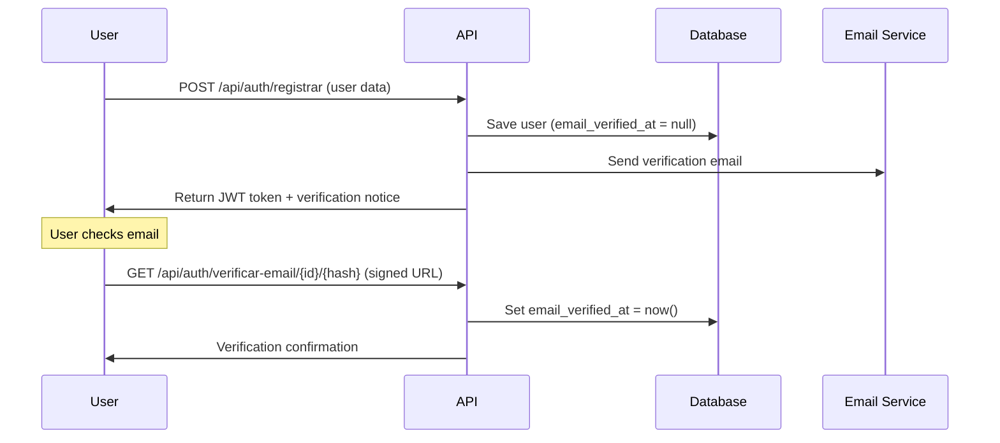

# Email Verification System - Technical Documentation

## Overview

This system implements mandatory email verification for new users using Laravel's native `MustVerifyEmail` system. When a user registers, they receive an email with a verification link that must be clicked before accessing all system functionalities.

## How It Works

### 1. Registration and Verification Flow



### 2. System Components

#### User Model
```php
// app/Models/Usuario.php
class Usuario extends Authenticatable implements MustVerifyEmail, JWTSubject
{
    // Implements necessary methods for email verification
}
```

#### Verification Field
```sql
-- database/migrations/usuarios.php
$table->timestamp('email_verified_at')->nullable();
```

#### Verification Routes
```php
// routes/api.php

// Public - email resend (requires JWT authentication)
Route::post('/auth/reenviar-verificacao-email', [AuthController::class, 'reenviarVerificacaoEmail'])
    ->middleware(['jwt.auth']);

// Verification (requires JWT authentication + signed URL)
Route::get('/auth/verificar-email/{id}/{hash}', [AuthController::class, 'verificarEmail'])
    ->name('verification.verify')
    ->middleware(['jwt.auth', 'signed']);
```

## Configuration

### 1. Email Configuration (Required)

In the `.env` file, configure the email provider:

#### For Development (using logs)
```bash
MAIL_MAILER=log
MAIL_FROM_ADDRESS="noreply@pharmedice.com"
MAIL_FROM_NAME="${APP_NAME}"
```

#### For Production (using SMTP)
```bash
MAIL_MAILER=smtp
MAIL_HOST=smtp.gmail.com
MAIL_PORT=587
MAIL_USERNAME=your-email@gmail.com
MAIL_PASSWORD=your-app-password
MAIL_ENCRYPTION=tls
MAIL_FROM_ADDRESS="noreply@pharmedice.com"
MAIL_FROM_NAME="${APP_NAME}"
```

#### For Production (using AWS SES)
```bash
MAIL_MAILER=ses
AWS_ACCESS_KEY_ID=your-access-key
AWS_SECRET_ACCESS_KEY=your-secret-key
AWS_DEFAULT_REGION=us-east-1
MAIL_FROM_ADDRESS="noreply@pharmedice.com"
MAIL_FROM_NAME="${APP_NAME}"
```

### 2. Application URL Configuration

```bash
# .env
APP_URL=https://yourdomain.com
```

**Important**: The `APP_URL` must be correct for verification links to work properly.

### 3. JWT Configuration

```bash
# .env
JWT_SECRET=your-jwt-secret-key
```

Generate a new key with:
```bash
php artisan jwt:secret
```

## API Endpoints

### 1. User Registration
```http
POST /api/auth/registrar
Content-Type: application/json

{
    "primeiro_nome": "John",
    "segundo_nome": "Doe",
    "apelido": "johndoe",
    "email": "john@example.com",
    "senha": "MyPassw0rd!",
    "senha_confirmation": "MyPassw0rd!",
    "confirmacao_senha": "MyPassw0rd!",
    "telefone": "(11) 99999-9999",
    "numero_documento": "12345678901",
    "data_nascimento": "1990-05-15",
    "aceite_comunicacoes_email": true,
    "aceite_comunicacoes_sms": false,
    "aceite_comunicacoes_whatsapp": true,
    "aceite_termos_uso": true,
    "aceite_politica_privacidade": true
}
```

**Success Response:**
```json
{
    "sucesso": true,
    "mensagem": "Usuário registrado com sucesso",
    "dados": {
        "access_token": "eyJ0eXAiOiJKV1QiLCJhbGc...",
        "token_type": "bearer",
        "expires_in": 3600,
        "usuario": {
            "id": "01HXXXXX...",
            "primeiro_nome": "John",
            "segundo_nome": "Doe",
            "email": "john@example.com",
            "tipo_usuario": "usuario",
            "email_verificado": false,
            "criado_em": "2025-10-09T10:30:00Z"
        },
        "mensagem_verificacao": "A verification email has been sent to john@example.com"
    }
}
```

### 2. Resend Verification Email
```http
POST /api/auth/reenviar-verificacao-email
Authorization: Bearer {jwt_token}
```

**Response:**
```json
{
    "sucesso": true,
    "mensagem": "Verification email resent to john@example.com"
}
```

### 3. Verify Email
```http
GET /api/auth/verificar-email/{id}/{hash}?expires={timestamp}&signature={signature}
Authorization: Bearer {jwt_token}
```

**Success Response:**
```json
{
    "sucesso": true,
    "mensagem": "Email verified successfully!",
    "dados": {
        "usuario": {
            "id": "01HXXXXX...",
            "email_verificado": true,
            "email_verificado_em": "2025-10-09T10:35:00Z"
        }
    }
}
```

## Implemented Validations

### 1. Required Fields
- `primeiro_nome`: Minimum 2 characters
- `segundo_nome`: Minimum 2 characters
- `apelido`: Unique, minimum 3 characters
- `email`: Valid format and unique
- `senha`: Minimum 8 characters with strength requirements
- `confirmacao_senha`: Must match password
- `telefone`: Brazilian format (xx) xxxxx-xxxx
- `numero_documento`: CPF with 11 digits, unique
- `data_nascimento`: Valid past date
- `aceite_termos_uso`: Required to be true
- `aceite_politica_privacidade`: Required to be true

### 2. Password Validation
Password must contain:
- Minimum 8 characters
- At least 1 uppercase letter
- At least 1 lowercase letter
- At least 1 number
- At least 1 special character

### 3. Data Duplication
- Email must be unique in the system
- CPF must be unique in the system
- Username must be unique in the system

## Customization

### 1. Email Templates

You can customize email templates by creating:

```php
// resources/views/emails/verify-email.blade.php
<!DOCTYPE html>
<html>
<head>
    <meta charset="utf-8">
    <title>Email Verification - {{ config('app.name') }}</title>
</head>
<body>
    <h1>Welcome to {{ config('app.name') }}!</h1>
    
    <p>Hello {{ $user->primeiro_nome }},</p>
    
    <p>To activate your account, click the link below:</p>
    
    <a href="{{ $url }}" style="background-color: #007bff; color: white; padding: 10px 20px; text-decoration: none; border-radius: 5px;">
        Verify Email
    </a>
    
    <p>If you didn't request this account, please ignore this email.</p>
    
    <p>This link expires in 60 minutes.</p>
</body>
</html>
```

### 2. Custom Messages

Modify messages in `AuthService.php`:

```php
// app/Services/AuthService.php
return [
    'success' => true,
    'mensagem' => 'Verification email resent to ' . $usuario->email
];
```

### 3. Expiration Time

Modify link expiration time in `AuthService.php`:

```php
// app/Services/AuthService.php
$urlVerificacao = URL::temporarySignedRoute(
    'verification.verify',
    now()->addHours(24), // 24 hours instead of 1 hour
    ['id' => $usuario->id, 'hash' => sha1($usuario->email)]
);
```

## Monitoring and Logs

### 1. Email Logs

During development, emails are logged in `storage/logs/laravel.log`:

```bash
tail -f storage/logs/laravel.log | grep "verification"
```

### 2. Check Verification Status

Query directly in database:

```sql
SELECT 
    primeiro_nome, 
    segundo_nome, 
    email, 
    email_verified_at,
    CASE 
        WHEN email_verified_at IS NULL THEN 'Not Verified'
        ELSE 'Verified'
    END as verification_status
FROM usuarios;
```

### 3. Verification Statistics

```sql
-- Users by verification status
SELECT 
    CASE 
        WHEN email_verified_at IS NULL THEN 'Not Verified'
        ELSE 'Verified'
    END as status,
    COUNT(*) as total
FROM usuarios 
GROUP BY (email_verified_at IS NULL);
```

## Troubleshooting

### Problem: Emails are not being sent

1. **Check email configuration in `.env`**
2. **Test SMTP connectivity:**
   ```bash
   php artisan tinker
   Mail::raw('Test', function($msg) { 
       $msg->to('test@example.com')->subject('Test'); 
   });
   ```

### Problem: Verification links expire too quickly

1. **Increase time in `AuthService.php`:**
   ```php
   now()->addMinutes(120) // 2 hours
   ```

### Problem: Incorrect URLs in emails

1. **Check `APP_URL` in `.env`**
2. **Clear configuration cache:**
   ```bash
   php artisan config:clear
   php artisan config:cache
   ```

### Problem: User cannot verify email

1. **Check if user is authenticated (valid JWT)**
2. **Check if link hasn't expired**
3. **Check logs for signature errors**

## Security

### 1. Signed URLs
Verification links use cryptographic signatures that:
- Prevent tampering
- Have expiration time
- Are unique for each user

### 2. Mandatory Authentication
User must be logged in (valid JWT) to verify email, preventing enumeration attacks.

### 3. Rate Limiting

To prevent spam, add rate limiting:

```php
// routes/api.php
Route::post('/auth/reenviar-verificacao-email', [AuthController::class, 'reenviarVerificacaoEmail'])
    ->middleware(['jwt.auth', 'throttle:3,1']); // 3 attempts per minute
```

## Testing

Run email verification tests:

```bash
# All signup and verification tests
php artisan test --filter="SignupTest|EmailVerificationTest"

# Only email verification tests
php artisan test --filter="EmailVerificationTest"

# Specific test
php artisan test --filter="usuario_pode_verificar_email_com_link_valido"
```

## Production Considerations

1. **Configure reliable email provider** (AWS SES, SendGrid, etc.)
2. **Configure own domain** for emails (`noreply@yourdomain.com`)
3. **Monitor email delivery rates**
4. **Configure SPF, DKIM and DMARC** for your domain
5. **Implement professional HTML templates**
6. **Configure adequate rate limiting**
7. **Monitor email verification logs**

---

This system is fully functional and tested, with 15/15 tests passing and complete coverage of use cases.