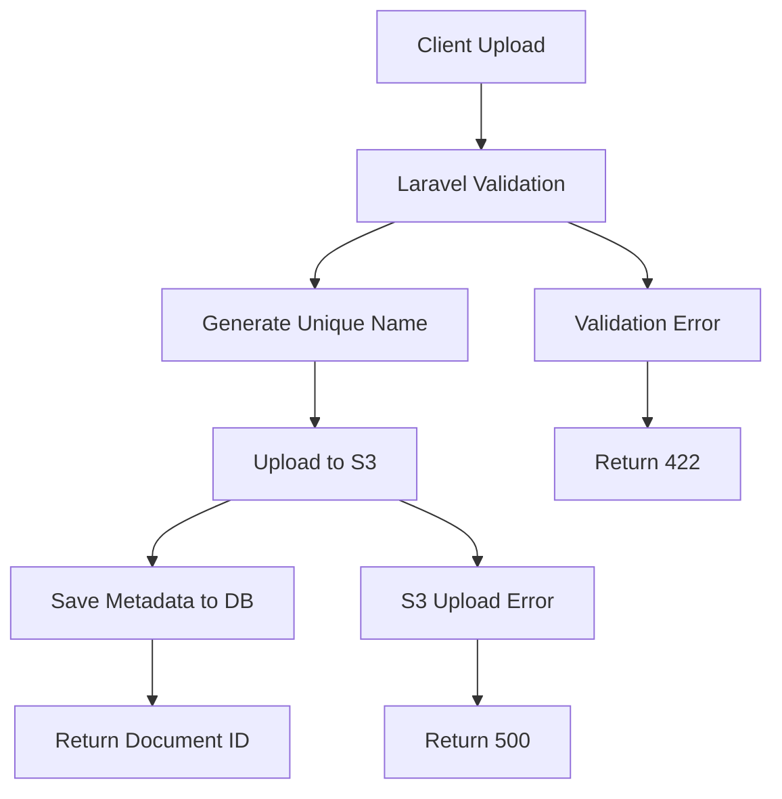

# File Upload & S3 Integration - Technical Flow

## Overview

The Pharmedice Customer Area system implements comprehensive PDF document management with AWS S3 cloud storage integration.

## Complete Upload Flow



## Detailed Step-by-Step Process

### 1. File Reception & Validation
- **Endpoint**: `POST /api/laudos`
- **Content-Type**: `multipart/form-data`
- **Validation**: PDF files only, max size configurable
- **Security**: File type verification, virus scanning (configurable)

### 2. Unique Filename Generation
```php
$uniqueName = Str::uuid() . '_' . time() . '_' . $originalName;
// Example: 550e8400-e29b-41d4-a716-446655440000_1696851600_document.pdf
```

### 3. S3 Upload Process
```php
// Upload with organized folder structure
$s3Path = "laudos/{year}/{month}/{uniqueName}";
Storage::disk('s3')->put($s3Path, $fileContents);
```

### 4. Database Storage
```sql
INSERT INTO laudos (id, usuario_id, titulo, descricao, url_arquivo, ativo, created_at, updated_at)
VALUES (ulid(), :usuario_id, :titulo, :descricao, :s3_path, true, NOW(), NOW());
```

## File Organization Structure

```
AWS S3 Bucket: pharmedice-documents
└── laudos/
    ├── 2024/
    │   ├── 10/
    │   │   ├── 550e8400-e29b-41d4-a716-446655440000_1696851600_document.pdf
    │   │   └── 750f9500-f39c-52e5-b827-556766551111_1696851700_report.pdf
    │   └── 11/
    └── 2025/
        └── 01/
```

## Security Features

### Access Control
- **Authentication Required**: All upload operations require valid JWT
- **Role-Based Access**: Only administrators can upload documents
- **User Ownership**: Users can only access their own documents
- **Signed URLs**: Temporary access for secure downloads

### File Validation
```php
// Validation rules for document upload
'arquivo' => [
    'required',
    'file',
    'mimes:pdf',           // Only PDF files
    'max:10240',           // Max 10MB
    'dimensions:max_width=2000,max_height=2000' // If images in PDF
]
```

### S3 Security Configuration
```json
{
    "Version": "2012-10-17",
    "Statement": [
        {
            "Effect": "Allow",
            "Action": ["s3:GetObject", "s3:PutObject", "s3:DeleteObject"],
            "Resource": "arn:aws:s3:::pharmedice-documents/laudos/*"
        }
    ]
}
```

## Download Process

### 1. Request Document
```http
GET /api/laudos/{id}/download
Authorization: Bearer {jwt_token}
```

### 2. Authorization Check
- Verify JWT token validity
- Check user permissions for document
- Administrators: Access all documents
- Clients: Access only own documents

### 3. Generate Signed URL
```php
// Generate temporary signed URL (expires in 1 hour)
$url = Storage::disk('s3')->temporaryUrl(
    $laudo->url_arquivo,
    now()->addHour()
);
```

### 4. Return File or Redirect
- **Option A**: Return signed URL for direct download
- **Option B**: Stream file through Laravel for access control

## Error Handling

### Common Error Scenarios
```json
// File too large
{
    "success": false,
    "message": "Validation failed",
    "errors": {
        "arquivo": ["The arquivo may not be greater than 10240 kilobytes."]
    }
}

// Invalid file type
{
    "success": false,
    "message": "Validation failed", 
    "errors": {
        "arquivo": ["The arquivo must be a file of type: pdf."]
    }
}

// S3 upload failure
{
    "success": false,
    "message": "Error uploading file to cloud storage"
}
```

## Performance Considerations

### Upload Optimization
- **Chunked Uploads**: For large files (future enhancement)
- **Progress Tracking**: Real-time upload progress
- **Retry Logic**: Automatic retry on network failures
- **Validation Early**: Validate before upload to save bandwidth

### Download Optimization
- **CDN Integration**: CloudFront for faster global access
- **Caching Headers**: Proper cache control for PDF files
- **Compression**: Gzip compression for metadata responses
- **Pagination**: Efficient listing for large document sets

## Monitoring & Logging

### Upload Metrics
```php
// Log upload events
Log::info('Document uploaded', [
    'user_id' => $user->id,
    'document_id' => $laudo->id,
    'file_size' => $file->getSize(),
    'upload_time' => $uploadTime,
    's3_path' => $s3Path
]);
```

### S3 Monitoring
- **Storage Usage**: Monitor bucket size and costs
- **Request Metrics**: Track GET/PUT request patterns
- **Error Rates**: Monitor failed uploads/downloads
- **Security Events**: Log unauthorized access attempts

## Configuration

### Environment Variables
```env
# AWS S3 Configuration
AWS_ACCESS_KEY_ID=your_access_key
AWS_SECRET_ACCESS_KEY=your_secret_key
AWS_DEFAULT_REGION=us-east-1
AWS_BUCKET=pharmedice-documents
AWS_USE_PATH_STYLE_ENDPOINT=false

# File Upload Limits
UPLOAD_MAX_SIZE=10240  # KB
ALLOWED_FILE_TYPES=pdf
```

### Laravel Configuration
```php
// config/filesystems.php
's3' => [
    'driver' => 's3',
    'key' => env('AWS_ACCESS_KEY_ID'),
    'secret' => env('AWS_SECRET_ACCESS_KEY'),
    'region' => env('AWS_DEFAULT_REGION'),
    'bucket' => env('AWS_BUCKET'),
    'url' => env('AWS_URL'),
    'endpoint' => env('AWS_ENDPOINT'),
    'use_path_style_endpoint' => env('AWS_USE_PATH_STYLE_ENDPOINT', false),
]
```

## Troubleshooting

### Common Issues

#### Upload Failures
1. **Check AWS credentials** in `.env`
2. **Verify bucket permissions** and IAM policies  
3. **Confirm file size limits** in PHP and Laravel config
4. **Test S3 connectivity** with AWS CLI

#### Download Issues
1. **Verify signed URL generation**
2. **Check file existence in S3**
3. **Validate user permissions**
4. **Monitor S3 access logs**

### Debug Commands
```bash
# Test S3 connectivity
aws s3 ls s3://pharmedice-documents/

# Check Laravel file configuration
php artisan config:show filesystems

# Test file upload from CLI
php artisan tinker
Storage::disk('s3')->put('test.txt', 'test content');
```

---

This technical documentation provides the complete flow for PDF upload and S3 integration in the Pharmedice Customer Area system.