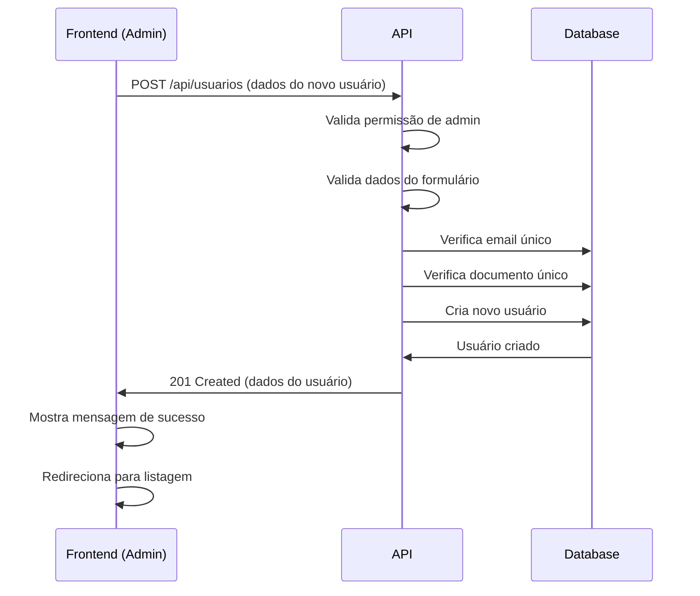

# API de Gerenciamento de Usuários - Administradores

## 📋 Visão Geral

Esta documentação descreve as rotas e funcionalidades da API para gerenciamento de usuários, **exclusivas para administradores**. Todas as rotas descritas aqui requerem:

1. **Autenticação JWT** (`Bearer Token`)
2. **Permissão de Administrador** (`tipo_usuario: 'administrador'`)

---

## 🔐 Autenticação

Todas as requisições devem incluir o header de autenticação:

```http
Authorization: Bearer {seu_token_jwt}
```

### Verificação de Permissões

O middleware `AdminMiddleware` verifica automaticamente:
- Se o token JWT é válido
- Se o usuário autenticado tem `tipo_usuario === 'administrador'`

**Resposta de erro (403) se não for admin:**
```json
{
  "sucesso": false,
  "mensagem": "Acesso negado. Apenas administradores podem acessar este recurso."
}
```

---

## 📍 Base URL

```
{API_URL}/api/usuarios
```

> **Nota:** Todas as URLs abaixo são relativas à base URL.

---

## 🔍 1. Listar Usuários (com Filtros e Paginação)

Lista todos os usuários ativos do sistema com suporte a filtros e paginação.

### Request

```http
GET /api/usuarios
```

### Query Parameters (Opcionais)

| Parâmetro | Tipo | Descrição | Exemplo |
|-----------|------|-----------|---------|
| `per_page` | integer | Quantidade de registros por página | `15` (padrão) |
| `page` | integer | Número da página | `1` (padrão) |
| `tipo_usuario` | string | Filtra por tipo de usuário | `administrador` ou `usuario` |
| `email` | string | Busca parcial por email | `joao@email.com` |
| `nome` | string | Busca parcial por nome (primeiro, segundo ou apelido) | `João Silva` |

### Exemplos de Requisição

**Listagem básica (página 1, 15 itens):**
```bash
GET /api/usuarios
```

**Listagem com 25 itens por página:**
```bash
GET /api/usuarios?per_page=25
```

**Filtrar apenas clientes:**
```bash
GET /api/usuarios?tipo_usuario=usuario
```

**Buscar por email:**
```bash
GET /api/usuarios?email=joao@email.com
```

**Buscar por nome:**
```bash
GET /api/usuarios?nome=João
```

**Combinando filtros:**
```bash
GET /api/usuarios?tipo_usuario=usuario&nome=Silva&per_page=20&page=2
```

### Response (200 OK)

```json
{
  "sucesso": true,
  "dados": {
    "current_page": 1,
    "data": [
      {
        "id": "01HQXYZ1234567890ABCDEFGH",
        "primeiro_nome": "João",
        "segundo_nome": "Silva",
        "apelido": "João",
        "email": "joao.silva@email.com",
        "telefone": "(11) 98765-4321",
        "numero_documento": "123.456.789-00",
        "data_nascimento": "1990-05-15",
        "tipo_usuario": "usuario",
        "aceite_comunicacoes_email": true,
        "aceite_comunicacoes_sms": false,
        "aceite_comunicacoes_whatsapp": true,
        "ativo": true,
        "email_verified_at": "2025-01-15T10:30:00.000000Z",
        "avatar": null,
        "provider": null,
        "google_id": null,
        "created_at": "2025-01-15T10:25:00.000000Z",
        "updated_at": "2025-01-15T10:30:00.000000Z"
      },
      // ... mais usuários
    ],
    "first_page_url": "http://localhost:8000/api/usuarios?page=1",
    "from": 1,
    "last_page": 5,
    "last_page_url": "http://localhost:8000/api/usuarios?page=5",
    "links": [
      {
        "url": null,
        "label": "&laquo; Previous",
        "active": false
      },
      {
        "url": "http://localhost:8000/api/usuarios?page=1",
        "label": "1",
        "active": true
      },
      // ... mais links
    ],
    "next_page_url": "http://localhost:8000/api/usuarios?page=2",
    "path": "http://localhost:8000/api/usuarios",
    "per_page": 15,
    "prev_page_url": null,
    "to": 15,
    "total": 73
  }
}
```

### Campos do Usuário

| Campo | Tipo | Descrição |
|-------|------|-----------|
| `id` | string (ULID) | Identificador único do usuário |
| `primeiro_nome` | string | Primeiro nome |
| `segundo_nome` | string\|null | Segundo nome (pode ser nulo) |
| `apelido` | string | Nome de exibição/apelido |
| `email` | string | Email (único no sistema) |
| `telefone` | string | Telefone de contato |
| `numero_documento` | string | CPF ou outro documento (único) |
| `data_nascimento` | date | Data de nascimento (formato: YYYY-MM-DD) |
| `tipo_usuario` | string | `administrador` ou `usuario` |
| `aceite_comunicacoes_email` | boolean | Aceita receber emails |
| `aceite_comunicacoes_sms` | boolean | Aceita receber SMS |
| `aceite_comunicacoes_whatsapp` | boolean | Aceita receber mensagens no WhatsApp |
| `ativo` | boolean | Status do usuário (apenas ativos são listados) |
| `email_verified_at` | datetime\|null | Data/hora da verificação do email |
| `avatar` | string\|null | URL do avatar (quando login social) |
| `provider` | string\|null | Provedor de autenticação (`google`, etc) |
| `google_id` | string\|null | ID do Google (se login social) |
| `created_at` | datetime | Data de criação |
| `updated_at` | datetime | Data da última atualização |

---

## 👤 2. Visualizar Usuário Específico

Busca os detalhes completos de um usuário pelo ID.

### Request

```http
GET /api/usuarios/{id}
```

### Path Parameters

| Parâmetro | Tipo | Descrição |
|-----------|------|-----------|
| `id` | string (ULID) | ID do usuário |

### Exemplo de Requisição

```bash
GET /api/usuarios/01HQXYZ1234567890ABCDEFGH
```

### Response (200 OK)

```json
{
  "sucesso": true,
  "dados": {
    "id": "01HQXYZ1234567890ABCDEFGH",
    "primeiro_nome": "João",
    "segundo_nome": "Silva",
    "apelido": "João",
    "email": "joao.silva@email.com",
    "telefone": "(11) 98765-4321",
    "numero_documento": "123.456.789-00",
    "data_nascimento": "1990-05-15",
    "tipo_usuario": "usuario",
    "aceite_comunicacoes_email": true,
    "aceite_comunicacoes_sms": false,
    "aceite_comunicacoes_whatsapp": true,
    "ativo": true,
    "email_verified_at": "2025-01-15T10:30:00.000000Z",
    "avatar": null,
    "provider": null,
    "google_id": null,
    "created_at": "2025-01-15T10:25:00.000000Z",
    "updated_at": "2025-01-15T10:30:00.000000Z"
  }
}
```

### Response (404 Not Found)

```json
{
  "sucesso": false,
  "mensagem": "Usuário não encontrado"
}
```

---

## ➕ 3. Criar Novo Usuário

Cria um novo usuário no sistema (apenas administradores).

### Request

```http
POST /api/usuarios
Content-Type: application/json
```

### Body Parameters

| Campo | Tipo | Obrigatório | Descrição | Validação |
|-------|------|-------------|-----------|-----------|
| `primeiro_nome` | string | ✅ Sim | Primeiro nome | Máx. 255 caracteres |
| `segundo_nome` | string | ✅ Sim | Segundo nome | Máx. 255 caracteres |
| `apelido` | string | ✅ Sim | Nome de exibição | Máx. 255 caracteres |
| `email` | string | ✅ Sim | Email | Formato válido, único no sistema |
| `senha` | string | ✅ Sim | Senha | Mínimo 6 caracteres |
| `telefone` | string | ✅ Sim | Telefone | Máx. 20 caracteres |
| `numero_documento` | string | ✅ Sim | CPF ou documento | Máx. 20 caracteres, único |
| `data_nascimento` | date | ✅ Sim | Data de nascimento | Formato: YYYY-MM-DD |
| `tipo_usuario` | string | ❌ Não | Tipo de usuário | `administrador` ou `usuario` (padrão: `usuario`) |
| `aceite_comunicacoes_email` | boolean | ❌ Não | Aceite emails | Padrão: `false` |
| `aceite_comunicacoes_sms` | boolean | ❌ Não | Aceite SMS | Padrão: `false` |
| `aceite_comunicacoes_whatsapp` | boolean | ❌ Não | Aceite WhatsApp | Padrão: `false` |

### Exemplo de Requisição

```json
{
  "primeiro_nome": "Maria",
  "segundo_nome": "Santos",
  "apelido": "Maria",
  "email": "maria.santos@email.com",
  "senha": "senha123456",
  "telefone": "(11) 91234-5678",
  "numero_documento": "987.654.321-00",
  "data_nascimento": "1995-08-20",
  "tipo_usuario": "usuario",
  "aceite_comunicacoes_email": true,
  "aceite_comunicacoes_sms": false,
  "aceite_comunicacoes_whatsapp": true
}
```

### Response (201 Created)

```json
{
  "sucesso": true,
  "mensagem": "Usuário criado com sucesso",
  "dados": {
    "id": "01HQABC9876543210XYZDEFGH",
    "primeiro_nome": "Maria",
    "segundo_nome": "Santos",
    "apelido": "Maria",
    "email": "maria.santos@email.com",
    "telefone": "(11) 91234-5678",
    "numero_documento": "987.654.321-00",
    "data_nascimento": "1995-08-20",
    "tipo_usuario": "usuario",
    "aceite_comunicacoes_email": true,
    "aceite_comunicacoes_sms": false,
    "aceite_comunicacoes_whatsapp": true,
    "ativo": true,
    "email_verified_at": null,
    "created_at": "2025-01-20T15:30:00.000000Z",
    "updated_at": "2025-01-20T15:30:00.000000Z"
  }
}
```

### Response (422 Unprocessable Entity) - Erro de Validação

```json
{
  "sucesso": false,
  "mensagem": "Dados inválidos",
  "erros": {
    "email": [
      "Email já cadastrado"
    ],
    "senha": [
      "Senha deve ter no mínimo 6 caracteres"
    ],
    "numero_documento": [
      "Número do documento já cadastrado"
    ]
  }
}
```

---

## ✏️ 4. Atualizar Usuário

Atualiza os dados de um usuário existente (apenas administradores).

### Request

```http
PUT /api/usuarios/{id}
Content-Type: application/json
```

### Path Parameters

| Parâmetro | Tipo | Descrição |
|-----------|------|-----------|
| `id` | string (ULID) | ID do usuário a ser atualizado |

### Body Parameters

> **Nota:** Todos os campos são **opcionais** na atualização. Envie apenas os campos que deseja modificar.

| Campo | Tipo | Descrição | Validação |
|-------|------|-----------|-----------|
| `primeiro_nome` | string | Primeiro nome | Máx. 255 caracteres |
| `segundo_nome` | string | Segundo nome | Máx. 255 caracteres |
| `apelido` | string | Nome de exibição | Máx. 255 caracteres |
| `email` | string | Email | Formato válido, único (exceto para o próprio usuário) |
| `senha` | string | Nova senha | Mínimo 6 caracteres |
| `telefone` | string | Telefone | Máx. 20 caracteres |
| `numero_documento` | string | CPF ou documento | Máx. 20 caracteres, único (exceto para o próprio usuário) |
| `data_nascimento` | date | Data de nascimento | Formato: YYYY-MM-DD |
| `tipo_usuario` | string | Tipo de usuário | `administrador` ou `usuario` |
| `aceite_comunicacoes_email` | boolean | Aceite emails | `true` ou `false` |
| `aceite_comunicacoes_sms` | boolean | Aceite SMS | `true` ou `false` |
| `aceite_comunicacoes_whatsapp` | boolean | Aceite WhatsApp | `true` ou `false` |

### Exemplos de Requisição

**Atualizar apenas email e telefone:**
```json
{
  "email": "novo.email@email.com",
  "telefone": "(11) 99999-8888"
}
```

**Atualizar tipo de usuário para administrador:**
```json
{
  "tipo_usuario": "administrador"
}
```

**Atualizar múltiplos campos:**
```json
{
  "primeiro_nome": "João Pedro",
  "apelido": "JP",
  "telefone": "(11) 98888-7777",
  "aceite_comunicacoes_whatsapp": false
}
```

**Redefinir senha do usuário:**
```json
{
  "senha": "novaSenhaSegura123"
}
```

### Response (200 OK)

```json
{
  "sucesso": true,
  "mensagem": "Usuário atualizado com sucesso",
  "dados": {
    "id": "01HQXYZ1234567890ABCDEFGH",
    "primeiro_nome": "João Pedro",
    "segundo_nome": "Silva",
    "apelido": "JP",
    "email": "novo.email@email.com",
    "telefone": "(11) 98888-7777",
    "numero_documento": "123.456.789-00",
    "data_nascimento": "1990-05-15",
    "tipo_usuario": "usuario",
    "aceite_comunicacoes_email": true,
    "aceite_comunicacoes_sms": false,
    "aceite_comunicacoes_whatsapp": false,
    "ativo": true,
    "email_verified_at": "2025-01-15T10:30:00.000000Z",
    "created_at": "2025-01-15T10:25:00.000000Z",
    "updated_at": "2025-01-20T16:45:00.000000Z"
  }
}
```

### Response (404 Not Found)

```json
{
  "sucesso": false,
  "mensagem": "Usuário não encontrado"
}
```

### Response (422 Unprocessable Entity)

```json
{
  "sucesso": false,
  "mensagem": "Dados inválidos",
  "erros": {
    "email": [
      "Email já cadastrado"
    ]
  }
}
```

---

## 🗑️ 5. Remover Usuário (Soft Delete)

Remove um usuário do sistema (soft delete - apenas marca como inativo).

### Request

```http
DELETE /api/usuarios/{id}
```

### Path Parameters

| Parâmetro | Tipo | Descrição |
|-----------|------|-----------|
| `id` | string (ULID) | ID do usuário a ser removido |

### Exemplo de Requisição

```bash
DELETE /api/usuarios/01HQXYZ1234567890ABCDEFGH
```

### Response (200 OK)

```json
{
  "sucesso": true,
  "mensagem": "Usuário removido com sucesso"
}
```

### Response (404 Not Found)

```json
{
  "sucesso": false,
  "mensagem": "Usuário não encontrado"
}
```

### ⚠️ Importante sobre Remoção

- A remoção é **soft delete**: o usuário não é deletado do banco, apenas marcado como `ativo: false`
- Usuários inativos **não aparecem** nas listagens
- O usuário **não consegue mais fazer login** após ser removido
- O email e documento do usuário removido **continuam reservados** (não podem ser reutilizados)

---

## 🔒 Rota Disponível para Todos os Usuários Autenticados

### Alterar Própria Senha

Permite que **qualquer usuário autenticado** (admin ou não) altere sua própria senha.

#### Request

```http
PUT /api/usuarios/alterar-senha
Content-Type: application/json
```

#### Body Parameters

| Campo | Tipo | Obrigatório | Descrição | Validação |
|-------|------|-------------|-----------|-----------|
| `senha_atual` | string | ✅ Sim | Senha atual do usuário | - |
| `nova_senha` | string | ✅ Sim | Nova senha | Mínimo 6 caracteres |
| `nova_senha_confirmation` | string | ✅ Sim | Confirmação da nova senha | Deve ser igual a `nova_senha` |

#### Exemplo de Requisição

```json
{
  "senha_atual": "minhasenhaantiga123",
  "nova_senha": "minhanovasenha456",
  "nova_senha_confirmation": "minhanovasenha456"
}
```

#### Response (200 OK)

```json
{
  "sucesso": true,
  "mensagem": "Senha alterada com sucesso"
}
```

#### Response (400 Bad Request) - Senha Atual Incorreta

```json
{
  "sucesso": false,
  "mensagem": "Senha atual incorreta"
}
```

#### Response (422 Unprocessable Entity) - Validação

```json
{
  "sucesso": false,
  "mensagem": "Dados inválidos",
  "erros": {
    "nova_senha": [
      "Nova senha deve ter no mínimo 6 caracteres",
      "Confirmação da senha não confere"
    ]
  }
}
```

---

## 🎯 Casos de Uso - Implementação no Front-end

### 1️⃣ Tela de Listagem de Usuários

**Funcionalidades:**
- Tabela paginada com todos os usuários
- Filtros por: tipo de usuário, email, nome
- Seletor de quantidade de itens por página (10, 15, 25, 50)
- Botões de ação: Visualizar, Editar, Remover
- Badge visual para tipo de usuário (admin/cliente)
- Indicador de email verificado
- Busca em tempo real (debounced)

**Exemplo de implementação React:**

```javascript
// Componente de listagem
const [users, setUsers] = useState([]);
const [loading, setLoading] = useState(false);
const [pagination, setPagination] = useState({
  currentPage: 1,
  perPage: 15,
  total: 0
});
const [filters, setFilters] = useState({
  tipo_usuario: '',
  email: '',
  nome: ''
});

const fetchUsers = async (page = 1) => {
  setLoading(true);
  try {
    const queryParams = new URLSearchParams({
      page,
      per_page: pagination.perPage,
      ...filters
    });
    
    const response = await api.get(`/usuarios?${queryParams}`, {
      headers: {
        'Authorization': `Bearer ${token}`
      }
    });
    
    if (response.data.sucesso) {
      setUsers(response.data.dados.data);
      setPagination({
        currentPage: response.data.dados.current_page,
        perPage: response.data.dados.per_page,
        total: response.data.dados.total,
        lastPage: response.data.dados.last_page
      });
    }
  } catch (error) {
    console.error('Erro ao buscar usuários:', error);
    // Tratar erro (mostrar toast/notificação)
  } finally {
    setLoading(false);
  }
};

useEffect(() => {
  fetchUsers();
}, [filters, pagination.perPage]);
```

### 2️⃣ Tela de Visualização de Usuário

**Funcionalidades:**
- Exibir todos os dados do usuário em formato readonly
- Botão para editar
- Indicadores visuais para preferências de comunicação
- Badge de status (ativo/inativo, email verificado)

### 3️⃣ Tela de Criação de Usuário

**Funcionalidades:**
- Formulário completo com validação
- Campos obrigatórios claramente indicados
- Máscara para CPF e telefone
- Seletor de tipo de usuário
- Checkboxes para preferências de comunicação
- Feedback visual de erros de validação

**Validações no front-end:**
- Primeiro nome: obrigatório, máx 255 caracteres
- Segundo nome: obrigatório, máx 255 caracteres
- Email: obrigatório, formato válido
- Senha: obrigatório, mínimo 6 caracteres
- Telefone: obrigatório, formato válido
- CPF: obrigatório, formato válido
- Data de nascimento: obrigatório, data válida, idade mínima

### 4️⃣ Tela de Edição de Usuário

**Funcionalidades:**
- Formulário pré-preenchido com dados atuais
- Todos os campos editáveis (exceto ID)
- Campo de senha opcional (vazio = não alterar)
- Opção de promover/rebaixar entre admin e usuário
- Confirmação antes de salvar alterações críticas
- Feedback visual de campos alterados

**Exemplo de implementação:**

```javascript
const [formData, setFormData] = useState({
  primeiro_nome: '',
  segundo_nome: '',
  apelido: '',
  email: '',
  telefone: '',
  numero_documento: '',
  data_nascimento: '',
  tipo_usuario: 'usuario',
  // ... outros campos
});

const handleUpdate = async (userId) => {
  try {
    const response = await api.put(`/usuarios/${userId}`, formData, {
      headers: {
        'Authorization': `Bearer ${token}`,
        'Content-Type': 'application/json'
      }
    });
    
    if (response.data.sucesso) {
      // Sucesso - mostrar mensagem e redirecionar
      toast.success('Usuário atualizado com sucesso!');
      navigate('/admin/usuarios');
    }
  } catch (error) {
    if (error.response?.status === 422) {
      // Erros de validação
      const erros = error.response.data.erros;
      // Mostrar erros no formulário
    } else {
      toast.error('Erro ao atualizar usuário');
    }
  }
};
```

### 5️⃣ Modal de Confirmação de Remoção

**Funcionalidades:**
- Modal de confirmação com informações do usuário
- Alerta sobre consequências da remoção
- Botões de cancelar e confirmar
- Loading state durante a operação

```javascript
const handleDelete = async (userId, userName) => {
  const confirmed = await showConfirmDialog({
    title: 'Remover Usuário',
    message: `Tem certeza que deseja remover o usuário "${userName}"? Esta ação marcará o usuário como inativo e ele não poderá mais acessar o sistema.`,
    confirmText: 'Sim, remover',
    cancelText: 'Cancelar',
    type: 'danger'
  });
  
  if (confirmed) {
    try {
      const response = await api.delete(`/usuarios/${userId}`, {
        headers: {
          'Authorization': `Bearer ${token}`
        }
      });
      
      if (response.data.sucesso) {
        toast.success('Usuário removido com sucesso!');
        fetchUsers(); // Recarregar lista
      }
    } catch (error) {
      toast.error('Erro ao remover usuário');
    }
  }
};
```

---

## 🛡️ Tratamento de Erros

### Códigos de Status HTTP

| Código | Significado | Quando Ocorre |
|--------|-------------|---------------|
| `200` | OK | Operação bem-sucedida (GET, PUT, DELETE) |
| `201` | Created | Usuário criado com sucesso |
| `400` | Bad Request | Dados inválidos ou lógica de negócio violada |
| `401` | Unauthorized | Token inválido ou expirado |
| `403` | Forbidden | Usuário não tem permissão de admin |
| `404` | Not Found | Usuário não encontrado |
| `422` | Unprocessable Entity | Erros de validação |
| `500` | Internal Server Error | Erro no servidor |

### Estrutura de Resposta de Erro

```json
{
  "sucesso": false,
  "mensagem": "Descrição do erro",
  "erros": {
    "campo": [
      "Mensagem de erro específica"
    ]
  }
}
```

### Recomendações de Tratamento

1. **401 Unauthorized**: Redirecionar para login
2. **403 Forbidden**: Mostrar mensagem "Acesso negado" e redirecionar
3. **422 Validation**: Mostrar erros nos campos específicos do formulário
4. **500 Server Error**: Mostrar mensagem genérica e tentar novamente

---

## 📊 Exemplo de Fluxo Completo

### Fluxo: Admin cria novo usuário cliente



---

## 🔄 Versionamento

**Versão atual:** 1.0.0  
**Última atualização:** 24 de outubro de 2025

---

## 📝 Notas Importantes

### ⚠️ Segurança

1. **Nunca armazene senhas em plain text** - a API já faz hash automaticamente
2. **Token JWT deve ser armazenado com segurança** (httpOnly cookies ou localStorage com cuidado)
3. **Sempre valide permissões no front-end** antes de mostrar opções de admin
4. **Implemente rate limiting** para prevenir ataques de força bruta

### 💡 Boas Práticas

1. **Use debounce** em campos de busca para evitar muitas requisições
2. **Implemente loading states** em todas as operações assíncronas
3. **Cache a lista de usuários** quando apropriado
4. **Mostre feedback visual** para todas as ações (toast, snackbar, etc)
5. **Implemente paginação infinita** ou "load more" para melhor UX
6. **Valide dados no front-end** antes de enviar para a API

### 🎨 Sugestões de UX/UI

1. **Tabela responsiva** com scroll horizontal em mobile
2. **Filtros colapsáveis** para economizar espaço
3. **Skeleton loaders** enquanto carrega dados
4. **Empty states** quando não há usuários
5. **Badges coloridos** para tipos de usuário e status
6. **Ícones intuitivos** para ações (editar, remover, visualizar)
7. **Confirmação em ações destrutivas** (remover usuário)
8. **Breadcrumbs** para navegação clara

---

## 🆘 Suporte

Para dúvidas ou problemas com a API, entre em contato com a equipe de desenvolvimento.

**Logs disponíveis em:**
- `storage/logs/laravel.log`

**Prefixo dos logs:**
- `UsuarioController::` para logs do controller
- `UsuarioService::` para logs do service

---

## 📚 Recursos Adicionais

- [Documentação completa da API](./README.md)
- [Guia de autenticação](./authentication.md)
- [Estrutura do projeto](./concepts/README.md)

---

**© 2025 Pharmedice - Customer Area API**
