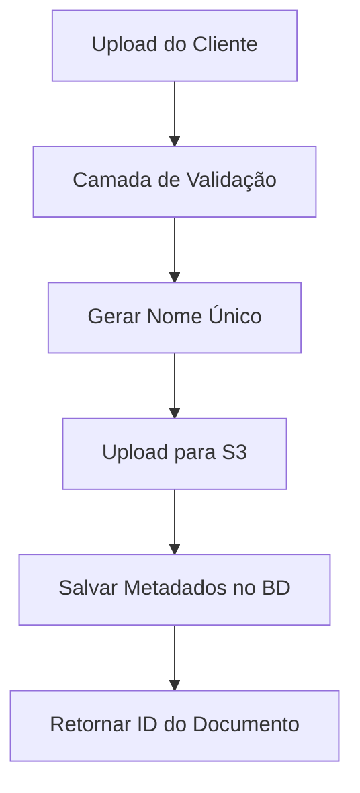

# Conceitos do Sistema - Pharmedice Customer Area

> Conceitos arquiteturais fundamentais e padrões de design utilizados no sistema backend da Área do Cliente Pharmedice.

## 🏗️ Arquitetura do Sistema

### Filosofia de Design Geral

O backend da Área do Cliente Pharmedice segue uma **arquitetura em camadas** com clara separação de responsabilidades:

- **Camada API** - Endpoints RESTful com respostas padronizadas
- **Camada de Serviços** - Lógica de negócios e processamento de dados
- **Camada de Modelos** - Entidades de dados e relacionamentos  
- **Camada de Infraestrutura** - Integrações externas (S3, Email, Banco de Dados)

### Padrões de Design Principais

#### 1. Padrão de Serviço
Lógica de negócios encapsulada em classes de serviço dedicadas:
- `AuthService` - Autenticação e gestão de usuários
- `UsuarioService` - Operações CRUD de usuários
- `LaudoService` - Gestão de documentos e operações de arquivo

#### 2. Padrão DTO (Data Transfer Objects)
Estruturas de dados padronizadas para comunicação da API:
- Validação e transformação de entrada
- Formatos de resposta consistentes
- Segurança de tipo e documentação

#### 3. Padrão Repository (via Eloquent)
Abstração de acesso a dados através do Eloquent ORM do Laravel:
- Separação limpa entre lógica de negócios e persistência de dados
- Camada de dados testável
- Padrões de consulta consistentes

## 🔐 Autenticação e Autorização

### JWT (JSON Web Tokens)
- **Autenticação sem estado** - Sem armazenamento de sessão no servidor
- **Baseado em tokens** - Portável entre diferentes clientes/dispositivos
- **Expiração configurável** - Padrão de 60 minutos com capacidade de renovação
- **Transmissão segura** - Tokens contêm informações codificadas do usuário

### Sistema Multi-Função
- **Função Administrador** (`administrador`)
  - Acesso CRUD completo a todos usuários e documentos
  - Capacidades de configuração do sistema
  - Permissões de gestão de usuários
  
- **Função Cliente** (`usuario`)  
  - Visualizar documentos próprios
  - Alterar própria senha
  - Buscar e filtrar documentos acessíveis

### Cadeia de Middleware
```php
// Exemplo de stack de middleware para endpoint admin protegido
Route::get('/usuarios', [UsuarioController::class, 'listar'])
    ->middleware(['jwt.auth', 'admin']);
```

## 📄 Sistema de Gestão de Documentos

### Arquitetura de Armazenamento de Arquivos
- **Processamento Local** - Validação e processamento inicial de arquivos
- **Armazenamento na Nuvem** - AWS S3 para armazenamento persistente e escalável
- **Armazenamento de Metadados** - PostgreSQL para informações pesquisáveis de documentos
- **Controle de Acesso** - Visibilidade de documentos baseada em função

### Fluxo de Upload de Arquivo


### Convenção de Nomenclatura
Arquivos são armazenados com nomes únicos para prevenir conflitos:
```
{uuid}_{timestamp}_{nome_original}.pdf
```

Organizados por hierarquia de data:
```
laudos/
├── 2024/
│   ├── 10/
│   │   ├── documento1.pdf
│   │   └── documento2.pdf
│   └── 11/
└── 2025/
```

## 🗄️ Design do Banco de Dados

### Estratégia de Chave Primária
- **ULIDs (Universally Unique Lexicographically Sortable Identifiers)**
  - Strings seguras para URL de 26 caracteres
  - Ordenadas por timestamp para melhor performance do banco
  - Globalmente únicas em todas as tabelas

### Estrutura de Relacionamentos
```
Usuario (Usuários)
├── id (ULID, PK)
├── primeiro_nome, segundo_nome
├── email (único)
├── numero_documento (CPF único)
└── email_verified_at (timestamp)

Laudo (Documentos)  
├── id (ULID, PK)
├── usuario_id (FK para Usuario)
├── titulo, descricao
├── url_arquivo (caminho S3)
└── timestamps

Permissao (Permissões)
├── id (ULID, PK)
├── nome, descricao
└── timestamps

PermissaoDoUsuario (Permissões do Usuário)
├── usuario_id (FK para Usuario)
├── permissao_id (FK para Permissao)
└── timestamps (PK composta)
```

### Integridade de Dados
- **Restrições de chave estrangeira** garantem integridade referencial
- **Restrições únicas** previnem emails/documentos duplicados
- **Soft deletes** preservam dados enquanto marcam como inativo
- **Timestamps** rastreiam tempos de criação e modificação

## 🔍 Sistema de Busca e Filtragem

### Capacidades de Busca
- **Busca full-text** em títulos e descrições de documentos
- **Filtragem baseada em usuário** - Usuários veem apenas seus documentos
- **Override de admin** - Administradores podem buscar todos os documentos
- **Suporte à paginação** - Manuseio eficiente de grandes conjuntos de resultados

### Implementação de Busca
```php
// Exemplo de query de busca
$laudos = Laudo::where('ativo', true)
    ->where(function($query) use ($termo) {
        $query->where('titulo', 'ILIKE', "%{$termo}%")
              ->orWhere('descricao', 'ILIKE', "%{$termo}%");
    })
    ->with('usuario:id,primeiro_nome,segundo_nome')
    ->paginate(15);
```

## 📧 Arquitetura do Sistema de Email

### Fluxo de Verificação de Email
- **Gatilho de Registro** - Envio automático de email na criação de usuário
- **URLs Assinadas** - Links de verificação criptograficamente seguros
- **Limitado no tempo** - Expiração configurável (padrão: 60 minutos)
- **Uso único** - Links se tornam inválidos após verificação bem-sucedida

### Integração de Serviço de Email
- **Desenvolvimento** - Log de arquivo para testes
- **Produção** - SMTP ou AWS SES para entrega confiável
- **Sistema de templates** - Templates de email HTML customizáveis
- **Suporte à localização** - Conteúdo de email multi-idioma

## 🛡️ Modelo de Segurança

### Proteção de Dados
- **Hash de Senhas** - bcrypt com rounds configuráveis
- **Validação de Entrada** - Regras de validação abrangentes para todos endpoints
- **Prevenção de Injeção SQL** - Queries parametrizadas via Eloquent
- **Proteção XSS** - Escape automático de saída nas respostas

### Controle de Acesso
- **Autenticação Obrigatória** - A maioria dos endpoints requer JWT válido
- **Autorização Baseada em Função** - Sistema de permissões granular
- **Propriedade de Recurso** - Usuários só podem acessar seus próprios recursos
- **Privilégios de Admin** - Acesso elevado para funções administrativas

### Segurança de Arquivos
- **Validação de Tipo** - Apenas arquivos PDF aceitos para uploads de documentos
- **Limites de Tamanho** - Tamanhos máximos de arquivo configuráveis
- **Escaneamento de Vírus** - Pode ser integrado com serviços na nuvem
- **Controle de Acesso** - Permissões de bucket S3 e URLs assinadas

## 📊 Considerações de Performance

### Otimização do Banco de Dados
- **Estratégia de Indexação** - Índices otimizados em campos consultados frequentemente
- **Otimização de Queries** - Joins eficientes e paginação
- **Pool de Conexões** - Gerenciado pela camada de banco de dados do Laravel
- **Benefícios do ULID** - Melhor performance de B-tree que UUIDs

### Estratégia de Cache
- **Cache de Configuração** - Comandos Artisan para otimização de produção
- **Cache de Resultado de Query** - Integração Redis para queries frequentes
- **Cache de Metadados de Arquivo** - Reduzir chamadas da API S3
- **Cache de Rotas** - Performance melhorada de roteamento de requisições

### Recursos de Escalabilidade
- **Design Sem Estado** - Capacidade de escalonamento horizontal
- **Armazenamento na Nuvem** - Capacidade virtualmente ilimitada de armazenamento de arquivos
- **Sistema de Filas** - Processamento assíncrono para operações pesadas
- **Pronto para CDN** - Assets estáticos podem ser distribuídos via CDN

## 🧪 Estratégia de Testes

### Áreas de Cobertura de Testes
- **Testes Unitários** - Métodos individuais de serviços e modelos
- **Testes de Feature** - Fluxos completos de endpoints da API
- **Testes de Integração** - Interações com banco de dados e serviços externos
- **Testes de Autenticação** - Geração e validação de tokens JWT

### Gestão de Dados de Teste
- **Factories de Banco** - Geração consistente de dados de teste
- **Seeders** - Ambientes de desenvolvimento reproduzíveis
- **Transações** - Limpeza automática do banco de teste
- **Mocking** - Simulação de serviços externos para testes confiáveis

## 🔄 Princípios de Design da API

### Convenção RESTful
- **URLs baseadas em recurso** - `/api/usuarios/{id}` em vez de `/api/getUser`
- **Métodos HTTP** - GET, POST, PUT, DELETE para operações apropriadas
- **Códigos de Status** - Códigos de resposta HTTP significativos
- **Paginação** - Paginação padronizada para endpoints de lista

### Formato de Resposta
Estrutura JSON consistente em todos os endpoints:
```json
{
    "success": boolean,
    "message": "string",
    "data": object|array,
    "errors": object (erros de validação)
}
```

### Tratamento de Erros
- **Erros de Validação** - 422 com mensagens detalhadas específicas de campo
- **Erros de Autenticação** - 401 com descrições claras de erro
- **Erros de Autorização** - 403 com contexto de permissão
- **Erros de Servidor** - 500 com mensagens de erro sanitizadas

## 🚀 Arquitetura de Deploy

### Configuração de Ambiente
- **Variáveis de Ambiente** - Gestão segura de configuração
- **Suporte Multi-ambiente** - Desenvolvimento, staging, produção
- **Gestão de Segredos** - Proteção de dados sensíveis
- **Cache de Configuração** - Otimização de performance de produção

### Requisitos de Infraestrutura
- **Servidor Web** - Apache ou Nginx com PHP-FPM
- **Banco de Dados** - PostgreSQL 12+ com indexação adequada
- **Camada de Cache** - Redis para cache de sessão e query
- **Armazenamento de Arquivos** - AWS S3 ou armazenamento de objeto compatível
- **Serviço de Email** - Relay SMTP ou serviço de email na nuvem

---

Estes conceitos arquiteturais garantem que o sistema seja escalável, seguro, maintível e siga as melhores práticas do Laravel, atendendo aos requisitos específicos da aplicação Área do Cliente Pharmedice.