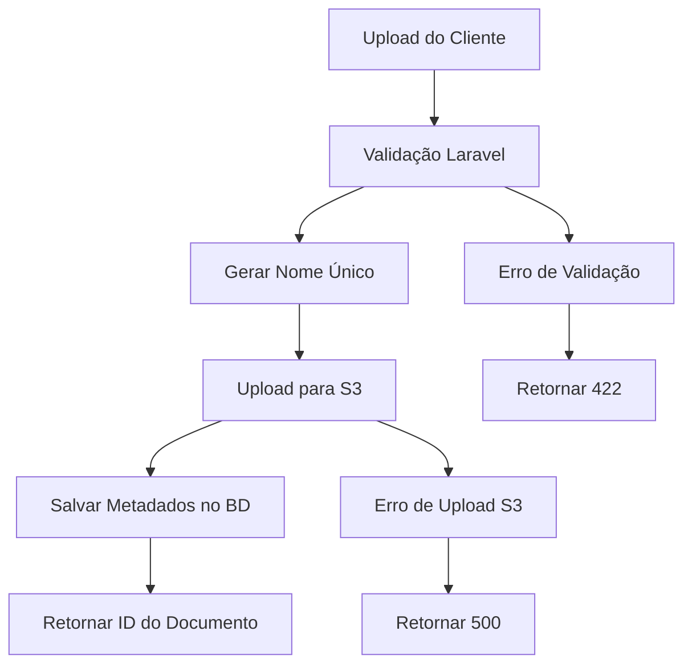

# Upload de Arquivos & Integração S3 - Fluxo Técnico

## Visão Geral

O sistema Pharmedice Customer Area implementa gerenciamento abrangente de documentos PDF com integração de armazenamento em nuvem AWS S3.

## Fluxo Completo de Upload



## Processo Detalhado Passo a Passo

### 1. Recepção & Validação de Arquivo
- **Endpoint**: `POST /api/laudos`
- **Content-Type**: `multipart/form-data`
- **Validação**: Apenas arquivos PDF, tamanho máximo configurável
- **Segurança**: Verificação de tipo de arquivo, escaneamento de vírus (configurável)

### 2. Geração de Nome de Arquivo Único
```php
$nomeUnico = Str::uuid() . '_' . time() . '_' . $nomeOriginal;
// Exemplo: 550e8400-e29b-41d4-a716-446655440000_1696851600_documento.pdf
```

### 3. Processo de Upload S3
```php
// Upload com estrutura de pasta organizada
$caminhoS3 = "laudos/{ano}/{mes}/{nomeUnico}";
Storage::disk('s3')->put($caminhoS3, $conteudoArquivo);
```

### 4. Armazenamento no Banco de Dados
```sql
INSERT INTO laudos (id, usuario_id, titulo, descricao, url_arquivo, ativo, created_at, updated_at)
VALUES (ulid(), :usuario_id, :titulo, :descricao, :caminho_s3, true, NOW(), NOW());
```

## Estrutura de Organização de Arquivos

```
Bucket AWS S3: pharmedice-documents
└── laudos/
    ├── 2024/
    │   ├── 10/
    │   │   ├── 550e8400-e29b-41d4-a716-446655440000_1696851600_documento.pdf
    │   │   └── 750f9500-f39c-52e5-b827-556766551111_1696851700_relatorio.pdf
    │   └── 11/
    └── 2025/
        └── 01/
```

## Recursos de Segurança

### Controle de Acesso
- **Autenticação Obrigatória**: Todas as operações de upload requerem JWT válido
- **Acesso Baseado em Função**: Apenas administradores podem fazer upload de documentos
- **Propriedade do Usuário**: Usuários só podem acessar seus próprios documentos
- **URLs Assinadas**: Acesso temporário para downloads seguros

### Validação de Arquivo
```php
// Regras de validação para upload de documento
'arquivo' => [
    'required',
    'file',
    'mimes:pdf',           // Apenas arquivos PDF
    'max:10240',           // Máx 10MB
    'dimensions:max_width=2000,max_height=2000' // Se imagens no PDF
]
```

### Configuração de Segurança S3
```json
{
    "Version": "2012-10-17",
    "Statement": [
        {
            "Effect": "Allow",
            "Action": ["s3:GetObject", "s3:PutObject", "s3:DeleteObject"],
            "Resource": "arn:aws:s3:::pharmedice-documents/laudos/*"
        }
    ]
}
```

## Processo de Download

### 1. Solicitar Documento
```http
GET /api/laudos/{id}/download
Authorization: Bearer {jwt_token}
```

### 2. Verificação de Autorização
- Verificar validade do token JWT
- Verificar permissões do usuário para o documento
- Administradores: Acesso a todos os documentos
- Clientes: Acesso apenas aos próprios documentos

### 3. Gerar URL Assinada
```php
// Gerar URL assinada temporária (expira em 1 hora)
$url = Storage::disk('s3')->temporaryUrl(
    $laudo->url_arquivo,
    now()->addHour()
);
```

### 4. Retornar Arquivo ou Redirecionar
- **Opção A**: Retornar URL assinada para download direto
- **Opção B**: Transmitir arquivo através do Laravel para controle de acesso

## Tratamento de Erros

### Cenários de Erro Comuns
```json
// Arquivo muito grande
{
    "success": false,
    "message": "Falha na validação",
    "errors": {
        "arquivo": ["O arquivo não pode ser maior que 10240 kilobytes."]
    }
}

// Tipo de arquivo inválido
{
    "success": false,
    "message": "Falha na validação", 
    "errors": {
        "arquivo": ["O arquivo deve ser do tipo: pdf."]
    }
}

// Falha no upload S3
{
    "success": false,
    "message": "Erro ao fazer upload do arquivo para armazenamento em nuvem"
}
```

## Considerações de Performance

### Otimização de Upload
- **Uploads em Chunks**: Para arquivos grandes (melhoria futura)
- **Rastreamento de Progresso**: Progresso de upload em tempo real
- **Lógica de Retry**: Retry automático em falhas de rede
- **Validação Antecipada**: Validar antes do upload para economizar banda

### Otimização de Download
- **Integração CDN**: CloudFront para acesso global mais rápido
- **Headers de Cache**: Controle de cache adequado para arquivos PDF
- **Compressão**: Compressão Gzip para respostas de metadados
- **Paginação**: Listagem eficiente para grandes conjuntos de documentos

## Monitoramento & Logging

### Métricas de Upload
```php
// Log de eventos de upload
Log::info('Documento enviado', [
    'user_id' => $user->id,
    'document_id' => $laudo->id,
    'file_size' => $file->getSize(),
    'upload_time' => $tempoUpload,
    's3_path' => $caminhoS3
]);
```

### Monitoramento S3
- **Uso de Armazenamento**: Monitorar tamanho do bucket e custos
- **Métricas de Requisição**: Rastrear padrões de requisições GET/PUT
- **Taxas de Erro**: Monitorar uploads/downloads falhados
- **Eventos de Segurança**: Log de tentativas de acesso não autorizado

## Configuração

### Variáveis de Ambiente
```env
# Configuração AWS S3
AWS_ACCESS_KEY_ID=sua_chave_acesso
AWS_SECRET_ACCESS_KEY=sua_chave_secreta
AWS_DEFAULT_REGION=us-east-1
AWS_BUCKET=pharmedice-documents
AWS_USE_PATH_STYLE_ENDPOINT=false

# Limites de Upload de Arquivo
UPLOAD_MAX_SIZE=10240  # KB
ALLOWED_FILE_TYPES=pdf
```

### Configuração Laravel
```php
// config/filesystems.php
's3' => [
    'driver' => 's3',
    'key' => env('AWS_ACCESS_KEY_ID'),
    'secret' => env('AWS_SECRET_ACCESS_KEY'),
    'region' => env('AWS_DEFAULT_REGION'),
    'bucket' => env('AWS_BUCKET'),
    'url' => env('AWS_URL'),
    'endpoint' => env('AWS_ENDPOINT'),
    'use_path_style_endpoint' => env('AWS_USE_PATH_STYLE_ENDPOINT', false),
]
```

## Solução de Problemas

### Problemas Comuns

#### Falhas de Upload
1. **Verificar credenciais AWS** no `.env`
2. **Verificar permissões do bucket** e políticas IAM  
3. **Confirmar limites de tamanho de arquivo** na config PHP e Laravel
4. **Testar conectividade S3** com AWS CLI

#### Problemas de Download
1. **Verificar geração de URL assinada**
2. **Verificar existência do arquivo no S3**
3. **Validar permissões do usuário**
4. **Monitorar logs de acesso S3**

### Comandos de Debug
```bash
# Testar conectividade S3
aws s3 ls s3://pharmedice-documents/

# Verificar configuração de arquivo Laravel
php artisan config:show filesystems

# Testar upload de arquivo via CLI
php artisan tinker
Storage::disk('s3')->put('test.txt', 'conteúdo teste');
```

---

Esta documentação técnica fornece o fluxo completo para upload de PDF e integração S3 no sistema Pharmedice Customer Area.